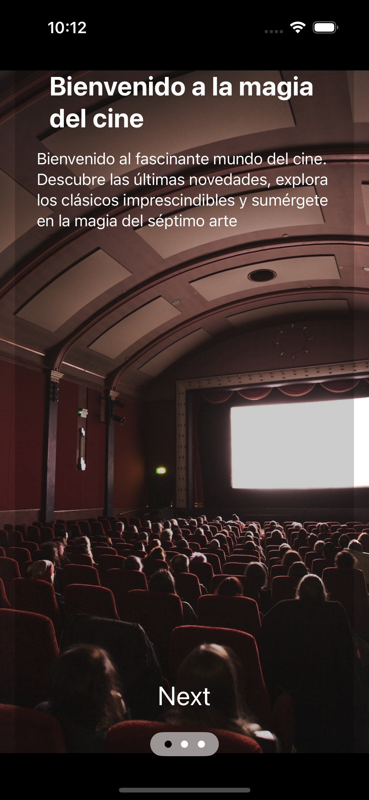

# TMDbMyApp

## Descripción
TMDbMyApp es un proyecto de práctica diseñado para aplicar los conocimientos en SwiftUI adquiridos durante un reciente bootcamp. Esta aplicación utiliza la API The Movie Database (TMDb) para proporcionar información actualizada sobre películas y actores, incluyendo detalles de estrenos, valoraciones y la disponibilidad en diferentes plataformas de TV, ya sea de pago o suscripción.

## Capturas de Pantalla

| Wellcome Screen | Movie detail | ScrollView horizontal actors |
|-----------------|--------------|------------------------------|
|  |  |  |

| Actor detail | Trailer link | Reproductor trailer |
|--------------|--------------|---------------------|
|  |  |  |

|   |   |   |   |
|---|---|---|---|
|  |  |  |  |
|  |  |  |  |
|  |   |   |   |

## Características Principales
**Pantalla de Bienvenida:** Una pantalla de bienvenida da paso a la página de inicio (Home View), desde donde los usuarios pueden navegar a través de un menú de pestañas con cuatro opciones: "Populares," "En Cartelera," "Mejor Valoradas" y "Próximamente."

**RankView Animado:** La aplicación presenta una vista de clasificación animada que muestra la puntuación de las películas.

**Vista de Grid:** Los usuarios pueden cambiar entre una vista de lista y una vista de cuadrícula mediante la barra de herramientas en la pantalla de inicio.

**Detalles de Película:** Al seleccionar una película, los usuarios pueden acceder a información detallada sobre la película y ver información sobre los actores, a los que también pueden acceder para obtener más detalles.

**Datos de Prueba:** La aplicación incluye datos de prueba para permitir la visualización de cambios en el lienzo sin necesidad de ejecutar la aplicación ni conectarse a la API.

## Ejecución de la Aplicación
Para ejecutar esta aplicación, necesitas obtener un token de la API TMDb y proporcionarlo en el proyecto. Ten en cuenta que el token debe ser gestionado de manera segura, y en este momento, no se ha implementado cifrado para ocultarlo en el proyecto. 

## Estado del Proyecto
TMDbMyApp se encuentra en una fase inicial y está en constante desarrollo. A medida que amplíe conocimientos y habilidades, se irán implementando nuevas características, pruebas y mejoras en el proyecto.

## Agradecimientos
Quiero expresar mi agradecimiento en especial a Alberto Alegre Bravo (Bitos88) por su apoyo incondicional en este proyecto y tantos otros, y a mi excepcional profesor del bootcamp Julio César Fernández de Apple Coding Academy.

